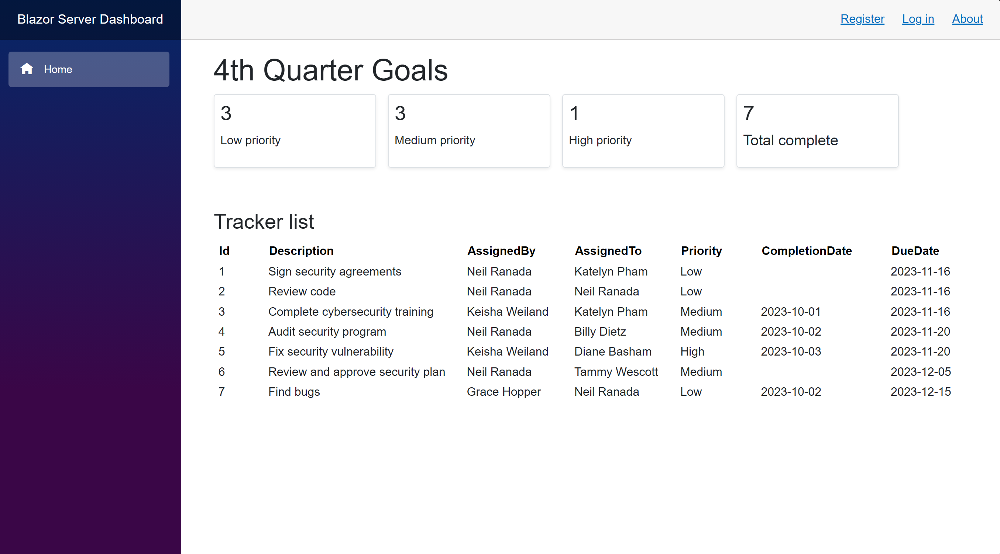

# Blazor Server Dashboard
***

## Description
Hello! I'm currently working on an exciting Blazor Server dashboard project. It's a great opportunity for me to bring together all my C# and ASP.NET Core knowledge and apply it to create web dashboards, which I've previously designed as a UX professional for clients.

I transitioned from a React/Typescript tech stack to teaching myself C# and ASP.NET Core. To prepare for the Microsoft Software Systems Academy (MSSA) program's Cloud Application Development (CAD) path for Military Veterans, I completed the required LinkedIn Learning courses for C# and programming fundamentals. I'm constantly expanding my skills by utilizing the Microsoft Learn website resources.  

 

So far, I have accomplished:
1. Using the latest .NET 8 preview runtime
2. Implementing Blazor Server User Interface (UI) framework for visual components
3. Programming the flow of mock data using Blazor component cascading parameters
4. Establishing an Entity Framework Core Object Relational Mapper (ORM) for translating data to a SQL database
5. Connecting the local development version of the app to a Microsoft SQL Server database
6. Deploying the app to Azure App Services: https://blazorserverdashboard.azurewebsites.net/
7. Connecting the deployed version of the app to an Azure SQL database

Things I'm working on:
1. Adding interactive components to allow people to submit data and update the respective SQL databases

## Contact and connect with me
neil.ranada@outlook.com  
https://www.linkedin.com/in/neilranada/

### Thanks for stopping by!

Neil Ranada, C# ASP.NET Core Developer
