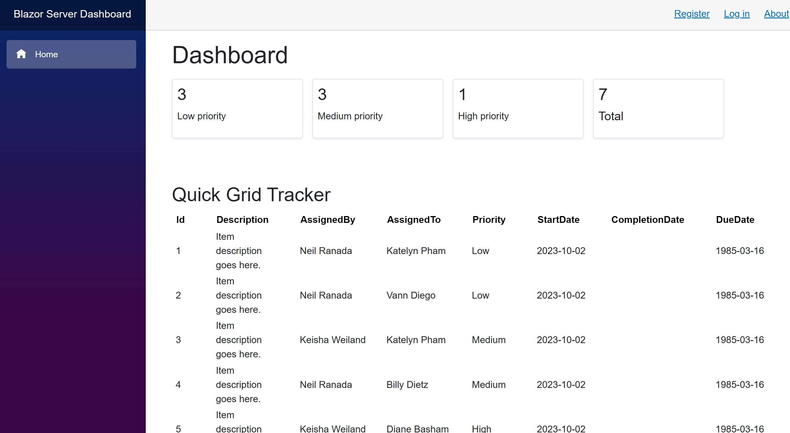

# Blazor Server Dashboard
***

## Description
Hey there! This is an ongoing project to build a Blazor Server dashboard. I taught myself C# and ASP.NET Core after switching from a React/Typescript tech stack. I completed the prerequisite LinkedIn Learning requirements for the Microsoft Software Systems Academy (MSSA) program's Cloud Application Development (CAD) path for Military Veterans: https://www.linkedin.com/learning/paths/software-development-fundamentals. I continue to teach myself through the Microsoft Learn website resources.  
 

So far, I have accomplished:
1. Using the latest .NET 8 preview runtime
2. Implementing Blazor Server User Interface (UI) framework for visuals
3. Establishing an Entity Framework Core Object Relational Mapper (ORM) for translating data to a SQL database
4. Connecting the local development version of the app to a Microsoft SQL Server database
5. Deploying the app to Azure App Services: https://blazorserverdashboard.azurewebsites.net/

Things I'm working on:
1. Adding interactive components to allow people to submit data and update the respective SQL databases

## Contact and connect with me
neil.ranada@outlook.com  
https://www.linkedin.com/in/neilranada/

### Thanks for stopping by!

